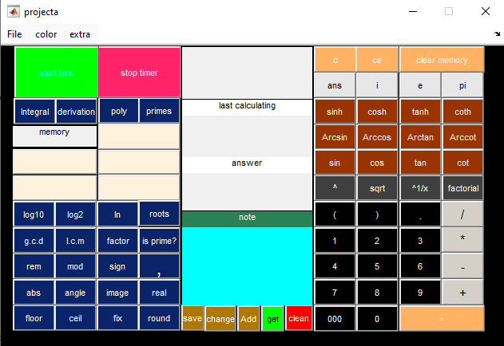

# Calculator-Project Date: June-10-2013
This is my final project for MATLAB programing course in 2013

***Everything remained unchanged, intentionally preserved as it was in June 2013, to serve as a lasting memory of the first project.***


MATLAB Scientific Calculator GUI

**Project Overview**

This MATLAB-based Graphical User Interface (GUI) is a scientific calculator designed to perform a wide range of mathematical operations, including arithmetic, trigonometric, logarithmic, matrix, and polynomial calculations. The GUI is user-friendly and provides a convenient way to perform complex computations interactively.

**Features**

Basic Arithmetic Operations: Addition, subtraction, multiplication, and division.

**Advanced Functions:**

Trigonometric functions (sin, cos, tan, cot, asin, acos, atan, acot),
Hyperbolic functions (sinh, cosh, tanh, coth),
Logarithmic functions (log, log10, log2),
Exponential and power functions (exp, sqrt, ^),
Factorial and prime number calculations,
Matrix and Polynomial Operations,
Polynomial integration and differentiation,
Roots of polynomials,
Matrix operations (e.g., gcd, lcm, mod, rem).

**Memory Functions:** Store and recall up to 5 values.

Customizable Interface: Change the background color of the calculator(Red, Green, Blue,Yellow, Cyan, Magenta).

Real-Time Calculations: Perform calculations and display results instantly.

## Notable Features

No Leading Zeros: You cannot start writing 0 or 000 directly. If you try to input 0 or 000 at the beginning, the GUI will ignore it.

Decimal Point Handling: If you push the . button, it automatically adds 0. to the input.

Note Functionality: The Note section is located in the middle-bottom part of the GUI. It acts as a small MATLAB command window where you can write and manipulate text.

Key Features:
Get Content from Top Cell:

You can retrieve the content from the top calculation cell and display it in the Note section.

This is useful for saving intermediate results or notes.

Change Note Content: Use the Change button to make the Note section editable.After editing, you can save the changes by clicking the Save button.

Save Note: Once you click Save, the Note section becomes read-only, and you cannot modify it unless you click Change again.

Add Note to Top Cell: Use the Add button to append the content of the Note section to the top calculation cell (text1).

Clear Note: Use the Clean button to clear the content of the Note section.

Timer Functionality: The Start and Stop buttons work like MATLAB's tic and toc functions, allowing you to measure elapsed time.

## Requirements
MATLAB R2013a or later (since the code uses str2double and other modern functions).

No additional toolboxes are required.

**Installation**
Clone or download this repository to your local machine.

Open MATLAB and navigate to the project directory.

Run the main file projecta.m to launch the calculator.

```matlab
>> run projecta.m
```

**Screenshot**

<div align="center">
  
</div>


**Additional Feature:**

Degree/Radian Conversion: 

This project also includes an extra GUI for converting angles between degrees and radians. You can access this feature in "extra" to easily switch between the two units for trigonometric calculations.
